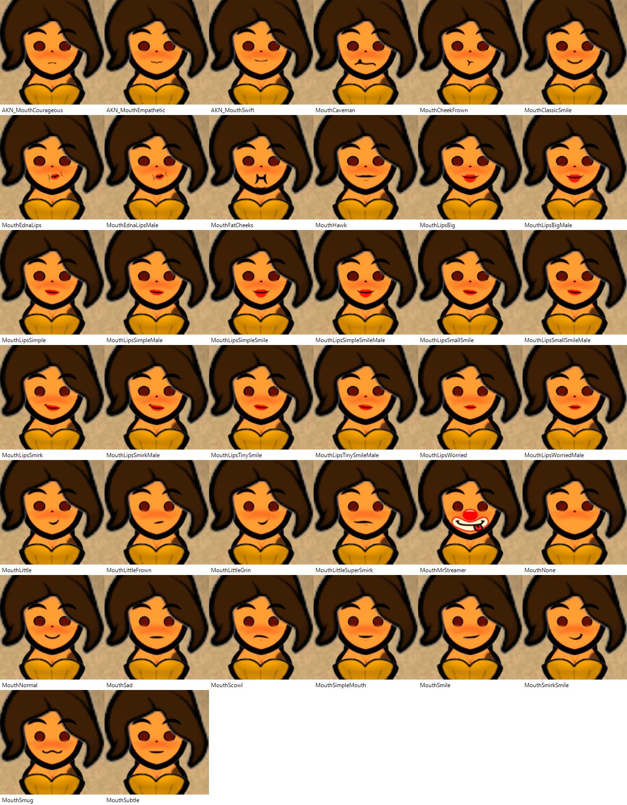
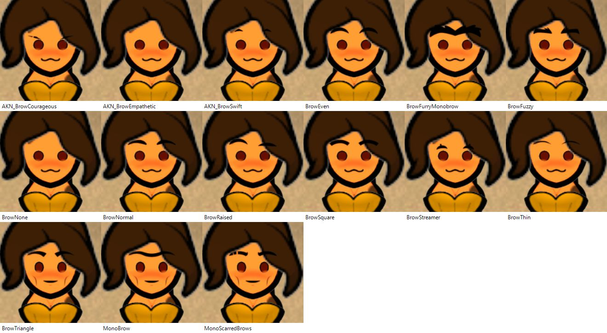
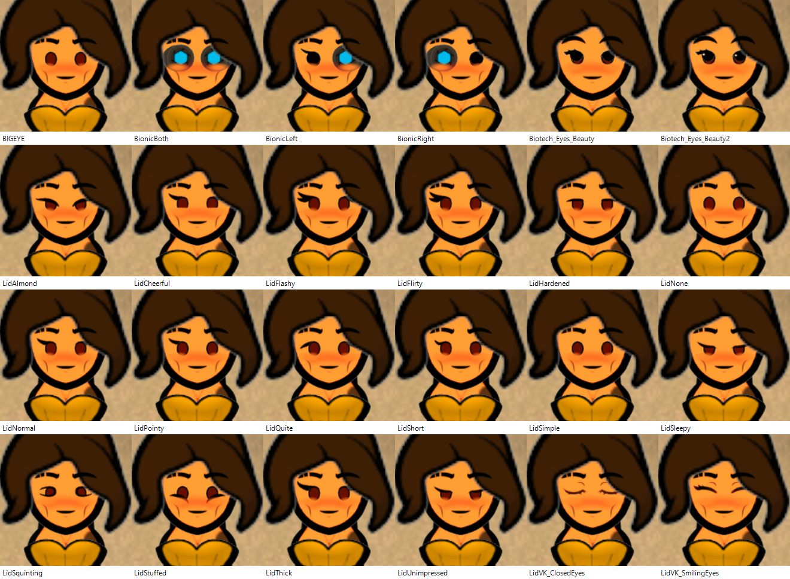
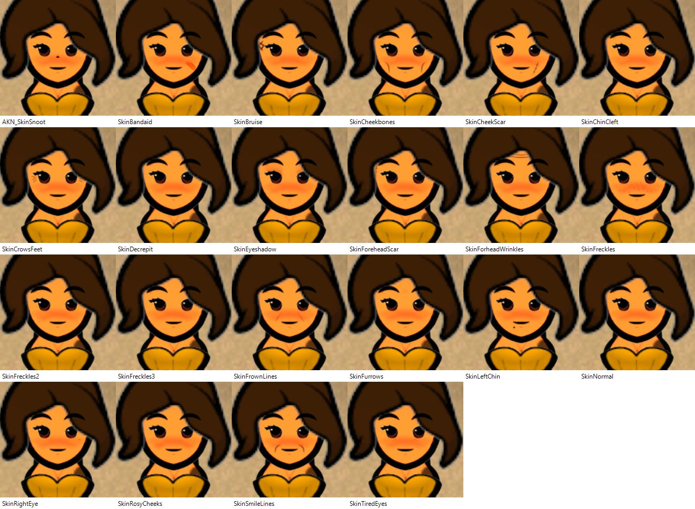
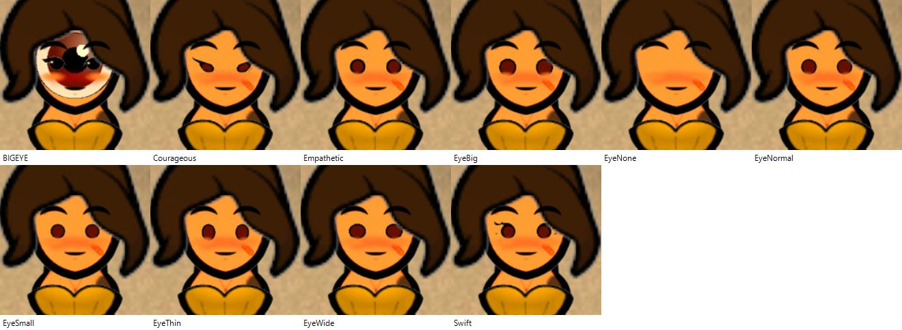
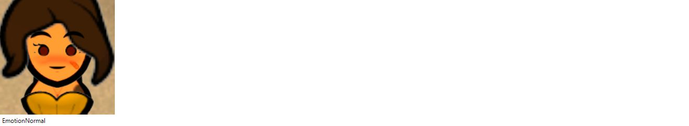
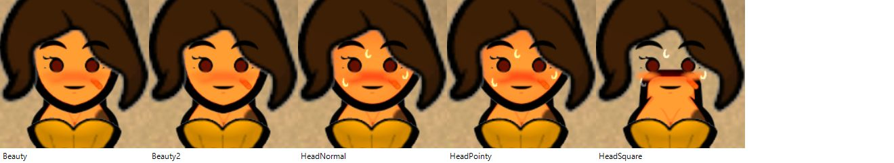
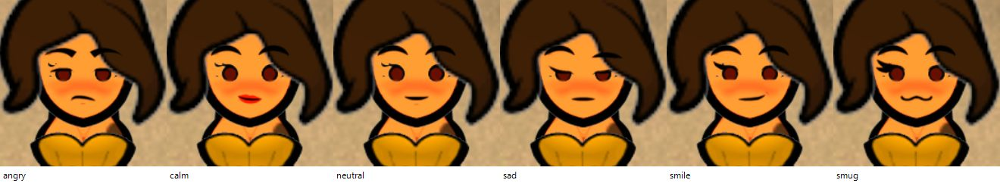

# Face parts and kits: the dictionary

Read on 2026-10-09 from run ff33 (`PickleTools/evidence/face-list3`, step `Nelim's Pickle Tools: the facial animations are listed`), with the standard mod list of the Sanctuary map (`wsl-deps.sanctuary.map`). A mod list that lacks a mod lacks its names: the step fails and prints the valid ones. Photos of each value: not taken yet (planned, one contact sheet per part).

Steps (all start with `Nelim's Pickle Tools: `): `"<pawn>" mouth is "<name>"`, `brows are`, `lids are`, `face skin is`, `eyeballs are`, `lid option is`, `emotion mark is`, `face head shape is`, and the whole-face `"<pawn>" face kit is "<kit>"`.

**Photographs (2026-10-09, runs 90ae, 58ce, 504a; Tests/Pickle/.../pickletools-face-parts-gallery.feature).** One photograph per value, in the order of the tables, on Nelim of the save Nelims-tribe at 20 degrees. Each scenario starts from the kit neutral and sets one part value after another, so a photograph also shows the parts set earlier in the same scenario (the cheek mark of a skin stays on the later eyeball photographs): read the changed part, not the whole face. Sheets: docs/Make-PartSheets.ps1.

## Mouths (`mouth is`)

| Mod | Names |
|---|---|
| (none, Facial Animation core) | MouthEdnaLipsMale, MouthLipsBigMale, MouthLipsSimpleMale, MouthLipsSimpleSmileMale, MouthLipsSmallSmileMale, MouthLipsSmirkMale, MouthLipsTinySmileMale, MouthLipsWorriedMale, MouthLittle, MouthNone, MouthSubtle |
| [NL] Facial Animation - Experimentals | MouthNormal |
| Akeron Extras - Facial Animations | AKN_MouthCourageous, AKN_MouthEmpathetic, AKN_MouthSwift |
| Vanilla Textures Expanded - [NL] Facial Animation | MouthCaveman, MouthCheekFrown, MouthClassicSmile, MouthEdnaLips, MouthFatCheeks, MouthHawk, MouthLipsBig, MouthLipsSimple, MouthLipsSimpleSmile, MouthLipsSmallSmile, MouthLipsSmirk, MouthLipsTinySmile, MouthLipsWorried, MouthLittleFrown, MouthLittleGrin, MouthLittleSuperSmirk, MouthMrStreamer, MouthSad, MouthScowl, MouthSimpleMouth, MouthSmile, MouthSmirkSmile, MouthSmug |

## Brows (`brows are`)

| Mod | Names |
|---|---|
| [NL] Facial Animation - Experimentals | BrowNormal |
| Akeron Extras - Facial Animations | AKN_BrowCourageous, AKN_BrowEmpathetic, AKN_BrowSwift |
| Vanilla Textures Expanded - [NL] Facial Animation | BrowEven, BrowFurryMonobrow, BrowFuzzy, BrowNone, BrowRaised, BrowSquare, BrowStreamer, BrowThin, BrowTriangle, MonoBrow, MonoScarredBrows |

## Lids (`lids are`)

| Mod | Names |
|---|---|
| (none) | BIGEYE, LidAlmond, LidCheerful, LidFlashy, LidFlirty, LidHardened, LidNone, LidNormal, LidPointy, LidQuite, LidShort, LidSimple, LidSleepy, LidSquinting, LidStuffed, LidThick, LidUnimpressed |
| [VK]FacialAnimation add closed eyes | LidVK_ClosedEyes, LidVK_SmilingEyes |
| Vanilla Textures Expanded - [NL] Facial Animation | BionicBoth, BionicLeft, BionicRight |
| Visual beauty for Facial Animation | Biotech_Eyes_Beauty, Biotech_Eyes_Beauty2 |

## Lid options (`lid option is`)

LidOptionNormal ([NL] Facial Animation - Experimentals).

## Skins (`face skin is`)

| Mod | Names |
|---|---|
| [NL] Facial Animation - Experimentals | SkinLeftChin, SkinNormal, SkinRightEye |
| Akeron Extras - Facial Animations | AKN_SkinSnoot |
| Vanilla Textures Expanded - [NL] Facial Animation | SkinBandaid, SkinBruise, SkinCheekbones, SkinCheekScar, SkinChinCleft, SkinCrowsFeet, SkinDecrepit, SkinEyeshadow, SkinForeheadScar, SkinForheadWrinkles, SkinFreckles, SkinFreckles2, SkinFreckles3, SkinFrownLines, SkinFurrows, SkinRosyCheeks, SkinSmileLines, SkinTiredEyes |

(`SkinForheadWrinkles` is spelled that way in the mod.)

## Eyeballs (`eyeballs are`)

| Mod | Names |
|---|---|
| (none) | BIGEYE, EyeBig, EyeNone, EyeNormal, EyeSmall, EyeThin, EyeWide |
| EyeGenes3 | Courageous, Empathetic, Swift |

## Emotion marks (`emotion mark is`)

EmotionNormal ([NL] Facial Animation - Experimentals).

## Head shapes (`face head shape is`)

| Mod | Names |
|---|---|
| [NL] Facial Animation - Experimentals | HeadNormal, HeadPointy, HeadSquare |
| Visual beauty for Facial Animation | Beauty, Beauty2 |

## Kits (`face kit is`)

Fixed list in the code (`ColonistRace/Source/FaceSteps.cs`). Each kit sets its parts together; a part step run afterwards overrides one part. A kit fails, naming the part, if a def is missing from the loaded mods.

| Kit | Mouth | Lids | Brows | Skin | Look on the photo (run 47e8) |
|---|---|---|---|---|---|
| `smile` | MouthSmile | LidCheerful | BrowEven | SkinRosyCheeks | Slight smile, flirty lids. |
| `calm` | MouthLipsTinySmile | LidSimple | BrowEven | | Small red lips, round eyes. |
| `sad` | MouthSad | LidUnimpressed | BrowRaised | | Half lids, flat mouth. |
| `angry` | MouthScowl | LidHardened | BrowTriangle | | Frown, angled brows. |
| `smug` | MouthSmug | LidFlirty | BrowEven | | A cat mouth. |
| `neutral` | MouthSimpleMouth | LidSimple | BrowEven | | A flat line. |

The kits use names of `Vanilla Textures Expanded - [NL] Facial Animation` (mouths, brows, skin) and of the core (lids). On a mod list without that mod, they fail.

## Heat

A kit or part step leaves the heat face (sweat, blush) of the room. To photograph a clean face, follow the parts or kit with `facial expression is "normal"` (proved on a photo, run 4a58); see FACIAL-ANIMATIONS.md for the 55 animations.
