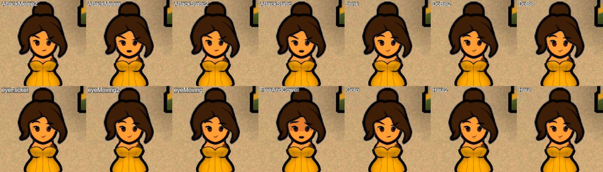
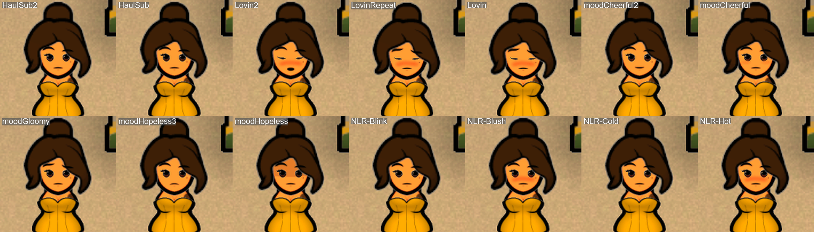
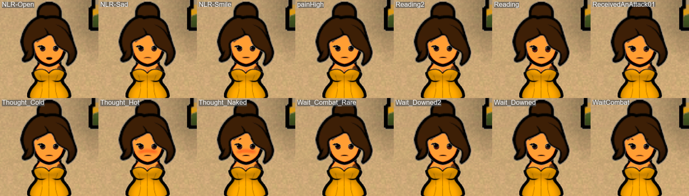

# Facial animations on a colonist (Nals Facial Animation)

Draft of 2026-10-08, filled as the gallery photos are read. Only groups seen on a photo are described as seen; the others say "not seen yet".
Photos: Nelim of the save `Nelims-tribe`, temperature held at 20 degrees, every animation played as `normal+<name>` (a neutral face with the animation on top), zoom 4.

## How to play one

```gherkin
Given Nelim's Pickle Tools: the temperature of the map is 20 degrees
And Nelim's Pickle Tools: I let 10 ticks pass
And Nelim's Pickle Tools: "Nelim" stands at (176, 120) facing South
When Nelim's Pickle Tools: "Nelim" facial expression is "normal+blink"
```

- The name is a `FaceAnimationDef` name. A wrong name fails and prints the valid ones. Names joined by `+` play together; for each part of the face the last one wins.
- Start with `normal`: it clears the heat face (sweat) that the room temperature would otherwise leave on the pawn.
- Let ticks pass BEFORE placing the pawn: the scene is paused, and without ticks nothing is recalculated. The pawn wanders during the ticks, so place her afterwards.
- The temporary animation ends when its frames have run out (it counts game ticks, it holds while the game is paused).
- To list the animations your mod list defines: step `Nelim's Pickle Tools: the facial animations are listed` (log lines `[face-animations]`).

## The 55 animations of the standard set, by group

Defined by `[NL] Facial Animation - Experimentals` (43), `[NL] Facial Animation - WIP` (9) and 3 without a mod name (`Lovin3`, `MVE_UnconsciousDowned`, `Thought_Tired`).

| Group | Animations | What the photo shows |
|---|---|---|
| Fight | `AttackMelee`, `AttackMelee2`, `AttackStatic`, `AttackStatic2` | Slanted brows, hard look; flat mouth (`...2`) or small open mouth. |
| Work and movement, calm face | `blink`, `DoBill`, `DoBill2`, `eyeFlicker`, `eyeMoving`, `eyeMoving2`, `Goto`, `Haul`, `Haul2` | Calm face, small smile. The difference between them is the eyes and brows only, subtle: a still photo does not tell them apart well; they are made for the movement. |
| Fear | `FleeAndCower` | Open mouth, shadow on the forehead. Reads as fear. |
| Hauling, sub | `HaulSub`, `HaulSub2` | Calm neutral face, flat mouth. |
| Lovin | `Lovin`, `Lovin2`, `LovinRepeat` | Half-closed eyes and strong pink blush; `Lovin2` adds an open mouth. |
| Mood: cheerful | `moodCheerful`, `moodCheerful2` | Light smile (`moodCheerful2` a little wider). |
| Mood: low | `moodGloomy`, `moodHopeless3`, `moodHopeless` | Frown, sad eyes; `moodHopeless` also shades the forehead. |
| NLR blink, cold | `NLR-Blink`, `NLR-Cold` | Neutral face in a still photo (made for movement; a cold effect is not visible here). |
| NLR blush, hot | `NLR-Blush`, `NLR-Hot` | Same look on the photo: red cheeks, no sweat. The redness left on a face after the sweat is gone is probably one of these. |
| NLR open, sad, smile | `NLR-Open`, `NLR-Sad`, `NLR-Smile` | `NLR-Open`: small open mouth. `NLR-Sad`: flat mouth, barely different from neutral. `NLR-Smile`: no visible change from neutral (confirmed twice). |
| Pain, attack | `painHigh`, `ReceivedAnAttack01` | Pained look: slightly tense brows and eyes, flat mouth. Subtle. |
| Reading | `Reading`, `Reading2` | Eyes cast down (`Reading`: reddish iris); a still photo shows little. |
| Thought: blush | `Thought_Hot`, `Thought_Naked` | Red cheeks, no sweat: same look as `NLR-Blush`/`NLR-Hot`. These are the mood thoughts "too hot" and "naked". |
| Thought: cold | `Thought_Cold` | Neutral face in a still photo. |
| Waiting | `Wait_Combat_Rare`, `WaitCombat`, `Wait_Downed`, `Wait_Downed2` | Neutral, watchful face; the downed ones differ in the eyes only, subtle. |
| Not seen yet | `Ingest`, `laydown`, `laydown2`, `laydown3`, `Mine`, `Research`, `Research2`, `SocialRelax`, `StandAndBeSociallyActive`, `Lovin3`, `MVE_UnconsciousDowned`, `Thought_Tired` | Gallery part 4 (`Thought_Tired` is not in the gallery). |

## Known traps

- `NLR-Smile` and `NLR-Sad` stacked on `normal` showed no change on the photos (run `669b`); `NLR-Blush` and `NLR-Open` did.
- Heat: the sweat is gone with the temperature held, ticks passed and the pawn placed afterwards (run `7682`, read by the owner); a soft blush on the cheeks stays, cause not established (maybe the blush animation).
- Face parts and kits (`mouth is`, `lids are`, `face kit is`) use def names that depend on the loaded mods; a mod list that lacks the def makes the step fail and print the valid names.
- Eye colour by `eye colour is rgb (...)` changes what the controller stores but not what is drawn on Nelim: use the genes.






